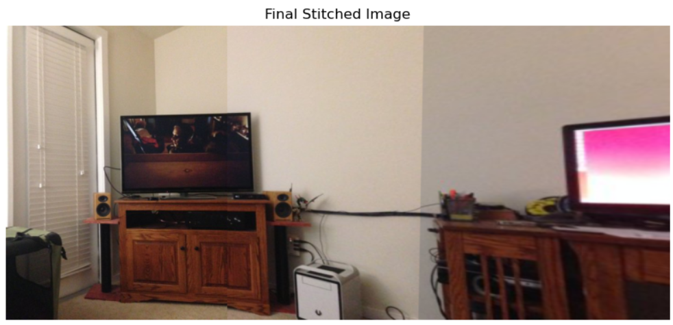
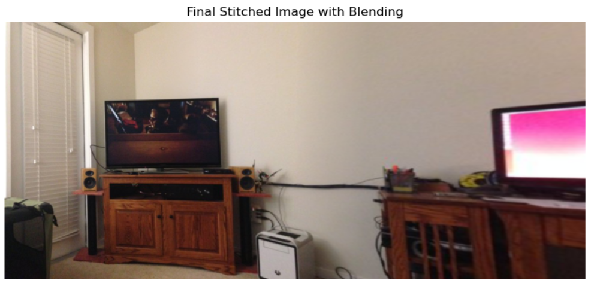

# 🪡 Image Stitching Module using SIFT & Homography (with Blending)

This module is a powerful image stitching component developed using Python and OpenCV. It aligns and blends multiple overlapping images into a single panoramic view using SIFT keypoint detection, feature matching, homography estimation, and smooth alpha blending.  
It was developed as a **core module** for a larger satellite or computer vision project.

---

## 📸 Purpose

The module automates the process of stitching aerial or ground-level images captured from slightly different viewpoints into a unified, distortion-free panorama — especially useful for **satellite imaging, 3D reconstruction, mapping, or AR/VR** platforms.

---

## ✨ Features

- 🔍 **SIFT Keypoint Detection**: Robust to scale and rotation
- 🧠 **Lowe’s Ratio Test**: Removes ambiguous feature matches
- 🧮 **Homography Estimation via RANSAC**: Handles perspective distortions
- 🧵 **Image Warping & Perspective Correction**
- 🌈 **Alpha Blending**: Smooth transition between overlapping regions
- 🧪 **Progressive Stitching**: Supports stitching sequences like (image0 + image1 + image2)

---

## 📂 File Structure

```
image_stitching_module/
│
├── stitch_basic.py            # Stitching using simple image overlay
├── stitch_blending.py         # Advanced stitching using alpha blending
├── stitch0.jpg                # Sample input images
├── stitch1.jpg
├── stitch2.jpg
└── README.md
```

---

## 🚀 Usage

### 1️⃣ Basic Stitching (no blending)

```bash
python stitch_basic.py
```

### 2️⃣ Advanced Blending Stitching

```bash
python stitch_blending.py
```

---

## 🔧 Requirements

Install dependencies:

```bash
pip install opencv-python matplotlib numpy
```

---

## 🧠 How It Works (Pipeline)

1. Convert input images to grayscale
2. Detect keypoints & descriptors using SIFT
3. Match keypoints using KNN matcher
4. Filter matches with Lowe’s ratio test
5. Estimate Homography matrix via RANSAC
6. Warp second image into the first’s plane
7. Apply **alpha blending** for seamless visual output

---

## 🧪 Sample Results

| Image 0 | Image 1 | Image 2 |
|---------|---------|---------|
|  |  |

> ✅ Output is a wide stitched panorama with soft transitions at the overlaps.

---

## 🔌 Integration Note

This module is designed to be **plug-and-play** for larger CV-based applications. You can call the `stitch_images_with_blending()` or `stitch_images()` function from your pipeline and pass appropriate images.

---

## 🧱 Future Extensions

- Cylindrical/panoramic projection
- GPU acceleration (with CUDA OpenCV)
- Multi-image graph-based stitching

---

## 🤝 Contributing

Feel free to open issues, suggest features, or fork and improve the module!

---

## 📜 License

MIT License
